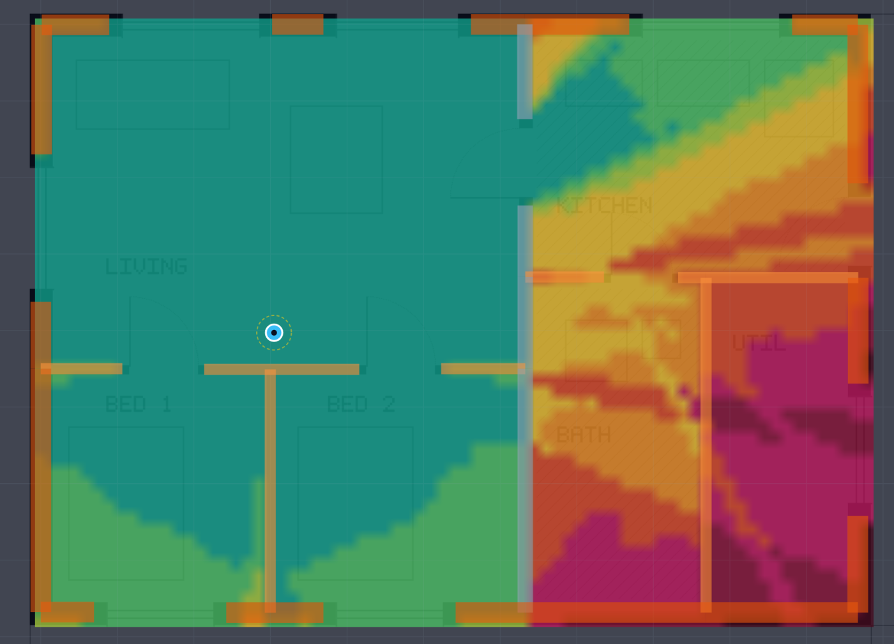
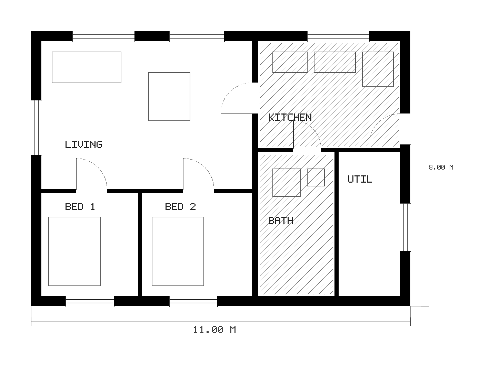
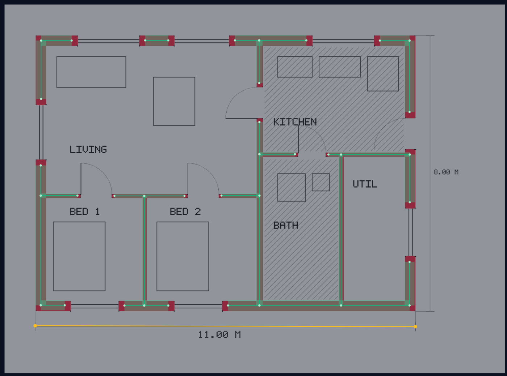
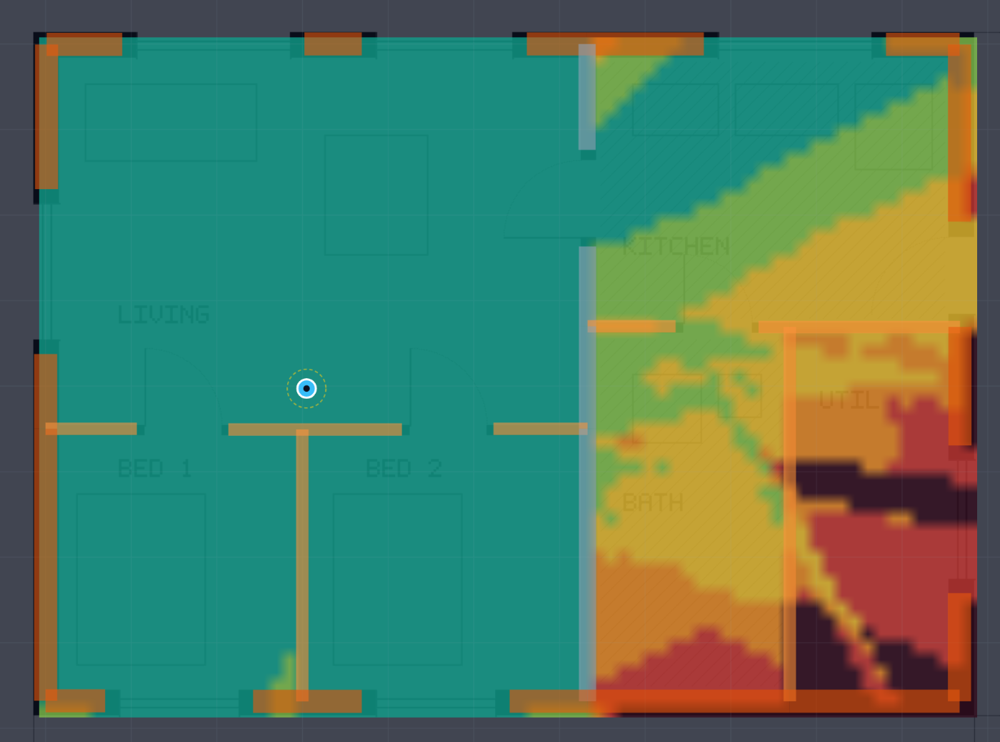

# WiFi-Sim

A free, offline Wi-Fi planning suite that runs in your browser. Upload a photo
or scan of your floorplan, trace the walls, describe what they are made of,
place your router, and get a coverage map computed from actual
electromagnetics.

Nothing is uploaded anywhere. It all runs locally.

**[Open the app](https://professorquantumuniverse.github.io/wifi-sim/)** ·
**[Documentation](https://professorquantumuniverse.github.io/wifi-sim/docs/)** ·
**[Start here](https://professorquantumuniverse.github.io/wifi-sim/docs/guide/getting-started)**



*One router in the living room. The signal barely notices the stud partitions
between the bedrooms and falls off a cliff at the load-bearing wall, and the one
strong path into the kitchen goes through the door opening rather than through
the wall. That is what the physics actually does, and it is what a
decibels-per-wall model cannot show you.*

## Try it in five minutes

You need a floorplan with at least one printed dimension on it. If you do not
have one to hand, use ours:

**[Download the example floorplan](https://professorquantumuniverse.github.io/wifi-sim/example-floorplan.png)**



Then follow [your first coverage map](https://professorquantumuniverse.github.io/wifi-sim/docs/guide/getting-started).

## Ways to run it

| | |
| --- | --- |
| **In a browser** | [professorquantumuniverse.github.io/wifi-sim](https://professorquantumuniverse.github.io/wifi-sim/) |
| **Locally, one command** | `npx wifi-sim@latest` |
| **In a container** | `docker run --rm -p 8080:8080 ghcr.io/professorquantumuniverse/wifi-sim:latest` |
| **On your own server** | `wifi-sim-dist.zip` from any [release](https://github.com/ProfessorQuantumUniverse/wifi-sim/releases) |

All of them run the identical application, and in every case the computation
happens on your machine. "Hosted" only means the program is downloaded from
GitHub, the way any web page is. Your floorplan is never uploaded, because there
is nothing on the other end to upload it to.

There is no double-clickable HTML file, and there cannot be: the tracing and the
solve both run in Web Workers, which browsers refuse to start on a page opened
from the file system. See
[ways to run it](https://professorquantumuniverse.github.io/wifi-sim/docs/guide/install).

## What it actually computes

Every path from the router to every point on the map is enumerated and solved in
closed form: the direct path, specular reflections up to second order,
transmission through each wall in between, and UTD edge diffraction around
corners and through door reveals.

Walls are not "6 dB per wall" lookups. Each build-up is solved with the exact
multilayer transfer matrix, per polarisation and incidence angle, from ITU-R
P.2040 material data. Rates come from the IEEE 802.11 sensitivity tables and
OFDM numerology, not from a rate chart.



*The tracing step. Green centrelines with their measured thicknesses, red
markers at the junctions, and the yellow calibration line along the printed
11.00 m dimension. The lettering, the furniture symbols, the hatching and the
dimension lines have all been filtered out by one slider.*

## Why bother

Free Wi-Fi planners are empirical. They add up a fixed dB per wall along the
line of sight, which means they cannot represent reflection, diffraction,
interference, or the fact that the same wall behaves differently at 2.4 and
5 GHz. Their heatmaps look convincing and are mostly decoration. The tools that
do real physics (Ekahau, iBwave, Ranplan) are closed and expensive.

Two examples of what the difference costs you:

* A 4-16-4 insulating glass unit attenuates 0.2 dB at 2.4 GHz and 9.3 dB at
  5.5 GHz. Same window, 9 dB apart, because at 5.5 GHz the cavity is near half a
  wavelength. No per-wall table can express that.
* Add the Low-E coating that every window fitted since about 2000 has, and it
  becomes 29 dB at 2.4 GHz and 34 dB at 5.5 GHz. That single fact explains most
  "why is my Wi-Fi dead on the balcony" mysteries, and most tools ignore it
  entirely.

Both of those numbers are asserted by the test suite on every commit.

The other principle: no invented numbers. Every physical constant carries its
source, and the app says so. Anything not covered by a standard is a required
input with a stated valid range, never a silent default. Where a model is used
outside its validity (rebar mesh at Wi-Fi wavelengths, for instance), it says
that too instead of returning a confident wrong answer.



*The same solve as throughput rather than signal strength, which is usually the
map you actually want. Dark means no link at all.*

## Is it right?

That question deserves a real answer rather than a claim, so the validation
suite runs on every commit and every pull request:

```bash
npm test
```

| What | Against | Agreement |
| --- | --- | --- |
| Direct path | Friis | better than 0.002 dB |
| Ground reflection | two-ray with the exact Fresnel coefficient | better than 0.02 dB |
| Brewster's angle | TM null at atan(sqrt(eps_r)) | reflectance below 1e-20 |
| Shadow boundary | half the incident field, 6.02 dB down | within 1 dB |
| Half-wave dipole | Balanis, D = 1.643 | 2.15 dBi |
| Low-E coating | t = 2/(2 + eta_0/R) | to nine decimals |
| PHY rates | published 802.11n/ac/ax/be tables | exact |

Plus the invariants any correct solver has to satisfy: energy conservation,
reciprocity, and that a wall face with windows and doors in it is tiled exactly
by its compiled panels.

Writing that suite found three real bugs, including a diffraction sign error
that inverted the lit and shadow regions for any wall drawn right to left. See
[the validation suite](https://professorquantumuniverse.github.io/wifi-sim/docs/reference/validation).

## What it does not model

[The honest list.](https://professorquantumuniverse.github.io/wifi-sim/docs/physics/limits)
Read it before you trust a number. The short version: one floor at a time,
single diffraction, reflections to second order, smooth surfaces, and a
single-station link. Most of the gaps are in the pessimistic direction.

## Documentation

| | |
| --- | --- |
| [Your first coverage map](https://professorquantumuniverse.github.io/wifi-sim/docs/guide/getting-started) | Ten minutes, assumes nothing |
| [Tracing a floorplan](https://professorquantumuniverse.github.io/wifi-sim/docs/guide/floorplan) | The step people get stuck on |
| [Reading the map](https://professorquantumuniverse.github.io/wifi-sim/docs/guide/results) | What the five layers actually mean |
| [The physics](https://professorquantumuniverse.github.io/wifi-sim/docs/physics/) | Materials, walls, ray tracing, rates |
| [What it does not model](https://professorquantumuniverse.github.io/wifi-sim/docs/physics/limits) | The most useful page |
| [Architecture](https://professorquantumuniverse.github.io/wifi-sim/docs/reference/architecture) | If you want to work on it |

## Contributing

**The most useful contribution needs no code: material data with a citation.**

The material library is limited to ITU-R P.2040 Table 3, because that is the
only source this project has and it does not invent numbers. PVC window
profiles, screed, tile, carpet, mineral wool, rigid insulation and aerated
concrete blocks are all missing. One sourced material improves every result the
tool produces for anybody who has it in their building.

Almost as useful: a floorplan the tracer handles badly, and a comparison between
a map this produced and a real measurement.

See [CONTRIBUTING.md](CONTRIBUTING.md).

## Stack

TypeScript, React, Vite, Zustand. No runtime dependencies beyond that, no
network calls, and no build step needed to read the physics: it lives in
`src/physics` and `src/engine`, and neither knows anything about the browser.

## Licence

**GNU General Public License v3.0 or later.** See [LICENSE](LICENSE).

You may use, study, modify and redistribute this freely. If you distribute a
modified version, you must make your source available under the same terms. That
was a deliberate choice: the physics engine is the valuable part of this
project, and it should stay free for everybody rather than become the basis of
somebody's closed product.

Copyright (C) 2026 Lorenzo Bay-Mueller.
